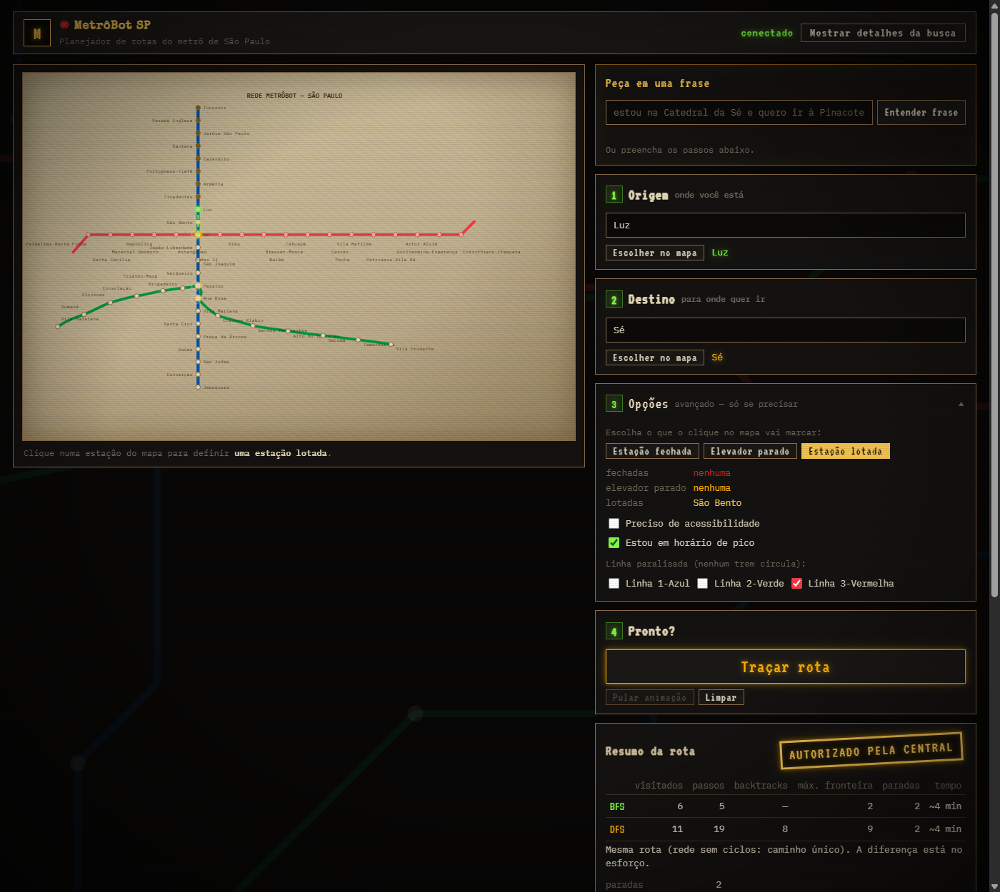

# MetrôBot SP — "Subsolo SP"

**Aluno:** Marcos Felipe dos Santos — RA 2403903

Desafio **MetrôBot SP 2.0** (Inteligência Artificial e Machine Learning —
Prof. Hercules Ramos). Planejador de rotas para as linhas **1-Azul**,
**2-Verde** e **3-Vermelha** do Metrô de São Paulo, com:

- busca em largura (BFS) e em profundidade (DFS) com estações bloqueadas;
- lógica proposicional e de primeira ordem (fatos + regras R1–R8 +
  encadeamento para frente com justificativa);
- um LLM via Groq como **intérprete** e **narrador**, com modo offline.

> **Regra de ouro — "O LLM conversa, o algoritmo decide."**
> O LLM só **interpreta** (extrai nomes de um pedido em linguagem natural) e
> **narra** os fatos já calculados. Quem decide a origem, o destino e o que
> está bloqueado é a base lógica; quem decide a rota é o BFS/DFS. Os dois
> ficam em Python (`core/`), e o front só reproduz os traces gerados pelo
> backend.


---

## Como rodar

Requisitos: Python 3.13 (testado com 3.13.14) e um navegador moderno.

```powershell
python -m venv .venv
.venv\Scripts\python -m pip install -r requirements.txt
.venv\Scripts\python -m uvicorn main:app
```

Abra **http://localhost:8000**.

### LLM: interpretação e narração (opcional)

Crie um arquivo `.env` na raiz. Ele está no `.gitignore` e nunca vai para o
repositório.

```
GROQ_API_KEY=sua_chave_groq
GROQ_MODEL=openai/gpt-oss-120b
```

**Sem chave, com chave inválida, sem internet ou com limite de uso esgotado:**

- **Intérprete:** usa o `interpretar_offline` da aula, que procura nomes
  conhecidos no texto.
- **Narrador:** usa um texto determinístico, montado só com os fatos do trace.

A demo nunca depende de internet. O PDF pede exatamente isso: o professor
pode rodar sem a chave.

> **Transparência sobre o modelo.** O código foi feito para o Llama, e o
> padrão é `llama-3.3-70b-versatile`. A conta Groq usada no desenvolvimento
> **não tem nenhum modelo Llama de conversa disponível**; os únicos Llama
> listados são os classificadores `llama-prompt-guard-2`. Por isso a
> validação real foi feita com **`GROQ_MODEL=openai/gpt-oss-120b`**, que
> aceita o modo JSON usado pelo intérprete. A própria aula usa
> `openai/gpt-oss-20b` como `MODELO_GROQ`.
>
> O modelo em uso aparece na interface (painel de narração e status da frase)
> e no campo `modelo` das respostas. Com uma chave que tenha acesso ao Llama,
> basta trocar o `GROQ_MODEL`.

### Testes

```powershell
.venv\Scripts\python -m pytest
```

Resultado esperado: **146 testes passando** e nenhum pulado. Os 6 casos
obrigatórios estão em `core/tests/test_planejador_e_casos.py`.

---

## Como usar

No alto do painel fica o **pedido em uma frase**; abaixo dele, os **4 passos
numerados**: origem, destino, opções e "Traçar rota".

1. **Peça em uma frase** (atalho, no topo): *"estou na Catedral da Sé e quero
   ir à Pinacoteca, uso cadeira de rodas"* e clique em **Entender frase**. O
   LLM (ou o modo offline) só extrai origem, destino, estações fechadas e
   acessibilidade; o backend confere cada nome e **recusa nomes
   inexistentes**, como "Avenida Paulista". Sem origem e destino válidos, o
   pedido é rejeitado inteiro, como no PDF. O que a frase preencher aparece
   nos passos abaixo, para você conferir antes de traçar.
2. **Passo 1 e 2 — origem e destino.** Digite o nome de uma estação ou de um
   lugar conhecido ("Pinacoteca") ou clique em **Escolher no mapa** e depois
   na estação. Os dois caminhos acendem os mesmos halos:
   - origem com halo verde fosforescente;
   - destino com halo âmbar;
   - estação fechada com cruz vermelha;
   - elevador parado com anel âmbar tracejado;
   - estação lotada com anel amarelo.
3. **Passo 3 — Opções (avançado).** Só se precisar:
   - marcar no mapa estação fechada, elevador parado ou estação lotada;
   - "preciso de acessibilidade" e "estou em horário de pico";
   - linha paralisada (1-Azul, 2-Verde ou 3-Vermelha).
4. **Passo 4 — Traçar rota.** O mapa reproduz o trace:
   - BFS em ondas por nível;
   - DFS com explorador âmbar e backtracking;
   - rota final desenhada traço a traço (fio de Ariadne);
   - o resultado recebe o selo **AUTORIZADO PELA CENTRAL** ou
     **TÚNEL OBSTRUÍDO**.
5. **Leia o resultado:**
   - **Resumo da rota:** paradas, baldeações e onde trocar, tempo estimado
     (2 min por trecho), alertas, lotação, estações bloqueadas pela lógica,
     regras disparadas e a corrida BFS × DFS;
   - **Passo a passo:** cada trecho com a linha e as baldeações;
   - **Narração:** o texto da IA (ou do servidor, quando ela não responde),
     com "Ouvir de novo" e "Parar".
6. **Mostrar detalhes da busca** (botão no topo) derruba o fundo de rede,
   scanlines, vinheta e ruído e revela, em texto puro, as
   **regras aplicadas** com fórmula e justificativa, o **registro passo a
   passo** da busca, a **tabela-verdade** e o **trace completo**: fila/pilha
   de cada passo, ordem, visitados, mapa de pais, métricas e todas as
   inferências com rodada e justificativa.


---

## Rede

As estações usam **exatamente os nomes do desafio**, por exemplo
**Japão-Liberdade** e **Patriarca-Vila Ré**. São 52 estações: as
integrações Sé (1↔3), Paraíso (1↔2) e Ana Rosa (1↔2) contam uma vez cada.

**Cores:** o mapa usa as cores reais do Metrô (`#0054A6`, `#009640` e
`#EF3A46`), por decisão do aluno. O dicionário `CORES` do PDF usa `#1e88e5`,
`#2e7d32` e `#d32f2f`.

### Convenção de vizinhos

A ordem dos vizinhos define os traces de BFS/DFS:

- **Ordem do percurso de cada linha:**
  - **L1:** norte→sul (Tucuruvi→Jabaquara);
  - **L2:** Vila Madalena→Vila Prudente;
  - **L3:** oeste→leste (Palmeiras-Barra Funda→Corinthians-Itaquera).

  Os vizinhos de uma estação são a anterior e a próxima.
- **Hubs:** vêm primeiro os vizinhos da L1 e depois os da outra linha,
  **sem repetidos**, como pede o PDF:
  - Sé → [São Bento, Japão-Liberdade, Anhangabaú, Pedro II]
  - Paraíso → [Vergueiro, Ana Rosa, Brigadeiro]
  - Ana Rosa → [Paraíso, Vila Mariana, Chácara Klabin]
- **Trechos em duas linhas:** a linha de cada trecho é registrada; o trecho
  Paraíso–Ana Rosa pertence às linhas 1 e 2. Na contagem de baldeações, o
  percurso **continua na mesma linha sempre que ela serve**.

### Propriedade da rede e explicação dos casos 5 e 6

- **Não há ciclos.** Neste modelo de 3 linhas existe **um único caminho**
  entre duas estações, porque o trecho Paraíso–Ana Rosa é compartilhado e não
  forma ciclo. BFS e DFS chegam sempre à **mesma rota**; o que muda é o
  **esforço**. Exemplo, de Luz a República: o BFS visita 15 estações e o DFS
  visita 37, com 32 backtracks; os dois fazem 4 paradas.
- **Caso 5, Vila Madalena → Jabaquara com Paraíso fechada: sem rota.** A
  parte oeste da Linha 2 (Vila Madalena…Brigadeiro) só se liga ao resto da
  rede por **Paraíso**. Com Paraíso fechada, essa parte da Linha 2 fica
  "cortada": não há outro trilho para sair dela.
- **Caso 6, Vila Prudente → Jabaquara com Paraíso fechada: 13 paradas.** Vila
  Prudente está na parte **leste** da Linha 2, que chega à Linha 1 por **Ana
  Rosa** (Chácara Klabin → Ana Rosa) sem passar por Paraíso. São 6 paradas na
  L2 e 7 na L1, com baldeação em Ana Rosa.
- **Resumo:** as duas viagens usam a Linha 2 e a mesma estação está fechada,
  mas **só a primeira precisa atravessar Paraíso**.



### Locais conhecidos (`proximo_de`)

| Linha | Local → estação | Origem |
|---|---|---|
| 1 | Shopping Metrô Tucuruvi → Tucuruvi · Terminal Rodoviário Tietê → Portuguesa-Tietê · Museu de Arte Sacra → Tiradentes · Pinacoteca → Luz · Museu da Língua Portuguesa → Luz · Mosteiro de São Bento → São Bento · Rua 25 de Março → São Bento · Catedral da Sé → Sé · Bairro da Liberdade → Japão-Liberdade · Centro Cultural São Paulo → Vergueiro · Shopping Metrô Santa Cruz → Santa Cruz · Universidade São Judas → São Judas · Terminal Rodoviário Jabaquara → Jabaquara | dicionário `LOCAIS` da aula |
| 2 | MASP → Trianon-Masp · Hospital das Clínicas → Clínicas | exemplos do desafio |
| 2 | Conjunto Nacional → Consolação · Shopping Pátio Paulista → Brigadeiro · Beco do Batman → Vila Madalena | pesquisados e conferidos pelo aluno |
| 3 | Theatro Municipal → Anhangabaú · Neo Química Arena → Corinthians-Itaquera | exemplos do desafio |
| 3 | Memorial da América Latina → Palmeiras-Barra Funda | pesquisado e conferido pelo aluno |

O total é de 21 locais, com pelo menos 3 por linha. A busca aceita nomes sem
acento e sem diferenciar maiúsculas, mas **nunca corrige um nome por
aproximação**.

---

## Base lógica

**Fatos de base:** `estacao(e)`, `pertence(e, l)` e `proximo_de(local, e)`.

**Fatos do pedido e do cenário:**
- `usuario_esta_em(l)` / `usuario_esta_na_estacao(e)`
- `usuario_quer_ir(l)` / `usuario_quer_ir_estacao(e)`
- `precisa_acessibilidade`, `fechada(e)`, `elevador_em_manutencao(e)`
- `paralisada(l)`, `horario_pico`, `lotada(e)`

**Como a lógica decide:**
- **Integrações** e **bloqueios** nunca são digitados: vêm das regras.
- **O planejador pede à base lógica** a origem, o destino, as estações
  bloqueadas e os alertas, e só então chama a busca.

| Regra | Fórmula | Significado |
|---|---|---|
| R1 | `∀l ∀e (usuario_esta_em(l) ∧ proximo_de(l,e) → origem(e))` | Local perto de e ⇒ e é a origem. Também aceita `usuario_esta_na_estacao(e)`. |
| R2 | `∀l ∀e (usuario_quer_ir(l) ∧ proximo_de(l,e) → destino(e))` | Local perto de e ⇒ e é o destino. Também aceita `usuario_quer_ir_estacao(e)`. |
| R3 | `∀e (fechada(e) → bloqueada(e))` | Estação fechada não pode estar na rota |
| R4 | `∀e (precisa_acessibilidade ∧ elevador_em_manutencao(e) → inacessivel(e))` | Elevador parado ⇒ inacessível para embarcar ou desembarcar. **Não** vira bloqueada. |
| R5 | `∀p ∀e (papel(p,e) ∧ inacessivel(e) → alerta(p,e))` | Alerta só se a estação inacessível for a origem ou o destino (`papel` ∈ {origem, destino}) |
| R6 | `∀e ∀l1 ∀l2 (pertence(e,l1) ∧ pertence(e,l2) ∧ l1 ≠ l2 → integracao(e))` | Deduz Sé, Paraíso e Ana Rosa como integrações |
| **R7** (grupo) | `∀e ∀l (paralisada(l) ∧ pertence(e,l) ∧ ¬integracao(e) → bloqueada(e))` | **Linha paralisada** (greve simulada): bloqueia as estações da linha, **exceto as integrações**, que continuam atendidas pela outra linha |
| **R8** (grupo) | `∀e (horario_pico ∧ lotada(e) → alerta_lotacao(e))` | **Horário de pico:** estação lotada gera alerta de lotação e não bloqueia |

**Motor de encadeamento para frente** (`core/logica.py`):
- **Rodadas:** como na aula, todas as regras de uma rodada enxergam os fatos
  do início dela. No exemplo do PDF, `destino(Luz)` e `inacessivel(Luz)`
  surgem na rodada 1 e `alerta(destino, Luz)` na rodada 2.
- **Justificativa:** cada inferência registra a rodada, a regra e os fatos
  usados.
- **Estratos:** a R7 usa negação (`¬integracao`), então as regras rodam em
  camadas. A R7 só é avaliada depois que a R6 chegou a um resultado estável,
  e com isso nunca bloqueia um hub por engano.

**Tabela-verdade** (gerada por código em `logica.tabela_verdade()`):
`pode_embarcar ≡ P ∧ (¬Q ∨ R)`, em que P = a estação está aberta, Q = o
passageiro precisa de acessibilidade e R = o elevador está funcionando.

## Casos de teste obrigatórios (BFS)

| # | Viagem | Cenário | Esperado | Obtido |
|---|---|---|---|---|
| 1 | Tucuruvi → Corinthians-Itaquera | normal | 22 paradas, 1 baldeação (Sé) | ✅ 22, Sé |
| 2 | Vila Madalena → Jabaquara | normal | 14 paradas, 1 baldeação (Paraíso ou Ana Rosa) | ✅ 14, Ana Rosa |
| 3 | Palmeiras-Barra Funda → Vila Prudente | normal | 16 paradas, 2 baldeações (Sé e Paraíso/Ana Rosa) | ✅ 16, Sé e Ana Rosa |
| 4 | Tucuruvi → Brás | Sé fechada | Sem rota | ✅ |
| 5 | Vila Madalena → Jabaquara | Paraíso fechada | Sem rota | ✅ |
| 6 | Vila Prudente → Jabaquara | Paraíso fechada | 13 paradas, via Ana Rosa | ✅ 13, Ana Rosa |

**Outros testes:**
- os asserts da função `rodar_testes()` da aula: Catedral da Sé → Pinacoteca
  com 2 paradas; alerta com elevador parado na Luz; nenhum alerta ao apenas
  **passar** pela Luz;
- as regras R1–R8, incluindo o encadeamento da Célula 14 do PDF;
- o intérprete offline, com os pedidos da Célula 18;
- BFS/DFS e o formato do trace;
- a API e a narração por SSE.


---

## Intérprete e narrador

**Intérprete** (`POST /api/interpretar`):
- **Prompt:** segue o Passo 5.2 da aula, com as 52 estações e os 21 locais,
  modo JSON e `temperature=0`.
- **Resposta do LLM:** só `{origem, destino, fechadas, acessibilidade}`.
- **Validação:** cada nome passa por `core.planejador.validar_nomes`.
  - Nome fora da rede: **422** com os nomes inválidos.
  - JSON fora do formato: **502**.
- **Sem LLM ou com erro da Groq:** usa `core/interprete.py`, o
  `interpretar_offline` da aula.
- **O intérprete só preenche os campos:** o passageiro confere e clica em
  "Traçar rota".

**Narrador** (`GET /api/narrar`, SSE):
- **O LLM recebe apenas o JSON de fatos** calculado pelo core: trechos,
  baldeações, tempo estimado, alertas e obstruções.
- **Prompt:** manda citar as baldeações (por exemplo, "Na Sé, troque para a
  Linha 3-Vermelha") e não inventar nada.
- **Eventos:** `fatos` → `inicio{fonte, modelo?, motivo?, reiniciar?}` →
  `trecho` (vários) → `fim`.
- **Se o LLM cair no meio:** chega um segundo `inicio` com `reiniciar: true`,
  e o texto offline substitui o parcial.
- **Stream sem `fim`, ou sem resposta por 30 s:** o front mostra erro.

---

## Contrato de trace

O front **nunca recalcula** busca nem lógica.

**Comum a BFS e DFS:** `algoritmo`, `estrutura`, `origem`, `destino`,
`bloqueadas`, `passos[]`, `ordem[]`, `visitados[]`, `pai{no: pai|null}`,
`encontrado`, `motivo`, `caminho[]`, `caminho_arestas[{de, para, linhas[]}]`,
`metricas{}`.

| | Passo (`passos[]`) | `metricas` |
|---|---|---|
| **BFS** (+ `niveis{no: nivel}`) | `{n, acao: expandir\|objetivo, no, nivel, descobertos[{no, nivel, linhas[]}], ignorados[{no, motivo}], fila[]}` | `nos_expandidos, max_fronteira, paradas, passos, nos_visitados` |
| **DFS** (a pilha é o caminho atual) | `{n, acao: empilhar\|avancar\|objetivo\|backtrack, no, de, linhas[], volta_para, profundidade, ignorados[], pilha[]}` | `backtracks, max_fronteira, profundidade_max, paradas, passos, nos_visitados` |

**Saída do planejador** (`POST /api/rota`):
- `origem`, `destino`: estações deduzidas pela R1 e pela R2;
- `cenario`: o pedido com nomes canônicos;
- `bloqueadas`, `alertas[{papel, estacao}]`, `alertas_lotacao`,
  `regras_disparadas`;
- `inferencia`: regras, inferências com justificativa e integrações;
- `buscas{BFS, DFS}`, `comparacao{ALG: {..., tempo_min}}`;
- `diagnostico{obstrucoes, trechos, baldeacoes, tempo_min}`.

## Endpoints

| Método | Rota | Descrição |
|---|---|---|
| GET | `/api/estacoes` | Linhas, cores, integrações (deduzidas pela R6) e o dossiê de cada estação |
| GET | `/api/locais` | Os 21 locais conhecidos, com estação e linhas |
| GET | `/api/tabela-verdade` | Tabela-verdade de `pode_embarcar` |
| POST | `/api/rota` | `{origem, destino, fechadas[], manutencao[], acessibilidade, paralisadas[], horario_pico, lotadas[], algoritmo}` → planejador. 404 para nome ou linha desconhecidos, 422 para entrada inválida |
| POST | `/api/inferencia` | Mesmo cenário, com origem e destino opcionais e `incluir_base` → inferência |
| POST | `/api/interpretar` | `{mensagem}` → `{fonte, offline, modelo, motivo, origem, destino, fechadas[], acessibilidade, extraido}` |
| GET | `/api/narrar` | Narração por SSE, com os mesmos parâmetros de `/api/rota` na query string |
| GET | `/docs` | Documentação interativa (Swagger) |

---

## Estrutura

```
.
├── core/                      # código avaliado (Python puro)
│   ├── grafo.py               # linhas, cores, vizinhos, locais, busca de nomes
│   ├── busca.py               # BFS e DFS com trace completo
│   ├── logica.py              # fatos, R1–R8, encadeamento, tabela-verdade
│   ├── planejador.py          # lógica + busca + diagnóstico (baldeações, tempo)
│   ├── interprete.py          # intérprete offline (da aula)
│   └── tests/                 # grafo, busca, lógica, intérprete, 6 casos
├── tests/
│   ├── test_api.py            # endpoints e narração SSE
│   └── test_interpretar.py    # intérprete LLM/offline, nomes inválidos
├── main.py                    # FastAPI: /api/* e static/
├── static/                    # front sem build (HTML + CSS + JS + SVG)
│   ├── index.html
│   ├── style.css              # design system "Despachante do Subsolo"
│   ├── app.js                 # só reproduz traces; nenhuma busca/lógica em JS
│   └── mapa.svg               # mapa-carta
├── notebook/                  # ver notebook/README.md
├── docs/screenshots/
├── requirements.txt           # versões fixadas
├── CLAUDE.md                  # regras do projeto e contratos
└── README.md
```

---

## Observações sobre a entrega

- **Formato:** o enunciado descreve a entrega como um **notebook com
  ipywidgets**, com "Executar tudo" e `rodar_testes()`. Este projeto
  implementa o mesmo conteúdo como **FastAPI + página HTML**, com os testes
  em `pytest`. O formato final será confirmado com o professor (ver
  [`notebook/README.md`](notebook/README.md)).
- **Material da aula:** o PDF do desafio **não** está no repositório, porque
  a reprodução dele é proibida pelo autor.

## Declaração de uso de IA

Usei o **Claude Code** (Anthropic) como agente de programação, sob minha supervisão.
Eu defini escopo, dados, regras do grupo (R7, R8) e locais, e validei cada fase.
O agente escreveu o código a partir do enunciado e da aula; os testes servem de prova.
Correções no caminho: nomes e R1–R5 ajustados ao PDF oficial; inferência alinhada
às rodadas da aula; a interface mostra o modelo real (a conta não tinha Llama).
