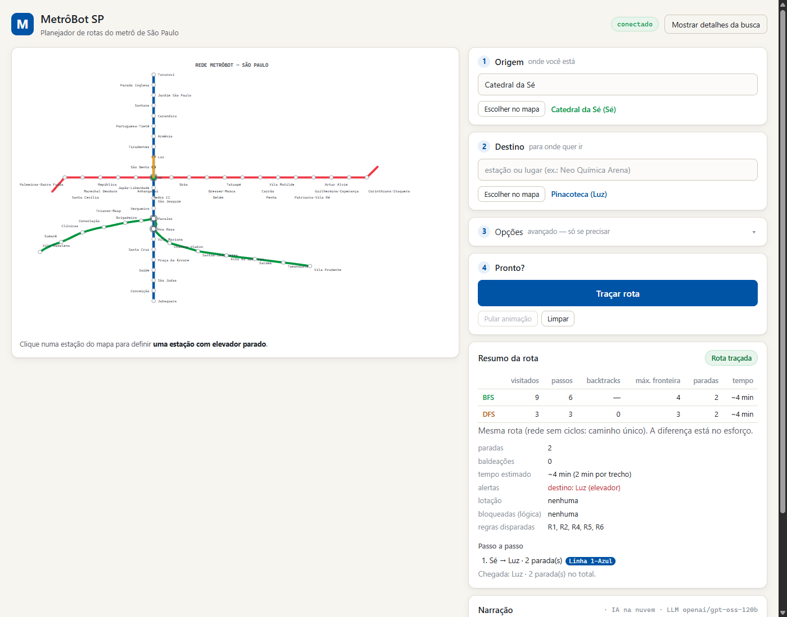
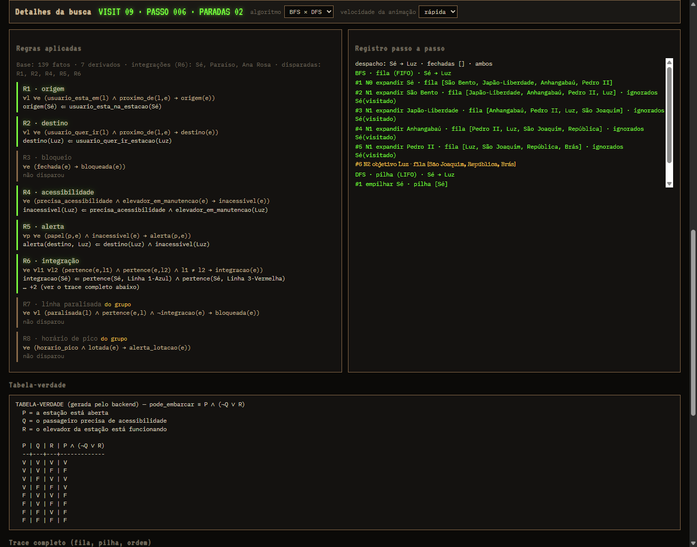
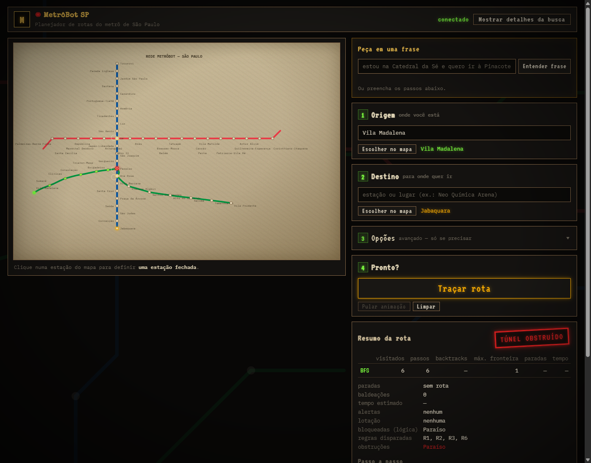

# MetrôBot SP — "Subsolo SP"

**Aluno:** Marcos Felipe dos Santos — RA 2403903

Projeto do Desafio MetrôBot SP 2.0: planejador de rotas para as linhas
**1-Azul**, **2-Verde** e **3-Vermelha** do Metrô de São Paulo, com busca em
largura (BFS) e em profundidade (DFS), estações bloqueadas, base lógica
(fatos + regras + encadeamento para frente) e o Llama (Groq) como intérprete
e narrador.

> **Regra de ouro — "A lanterna ilumina, o algoritmo decide."**
> O Llama só **interpreta** (extrai nomes de estações de um pedido em
> linguagem natural) e **narra** os fatos já calculados. Quem decide a rota é
> o BFS/DFS e quem decide o que está fechado é a base lógica, ambos em Python
> (`core/`).
> O front apenas reproduz os traces gerados pelo backend.



---

## Como rodar

Requisitos: Python 3.13 (testado com 3.13.14) e um navegador moderno.

```powershell
python -m venv .venv
.venv\Scripts\python -m pip install -r requirements.txt
.venv\Scripts\python -m uvicorn main:app
```

Abra **http://localhost:8000**.

### Llama: interpretação e narração (opcional)

Crie um arquivo `.env` na raiz do projeto (ele está no `.gitignore` e nunca
vai para o repositório):

```
GROQ_API_KEY=sua_chave_groq
# opcional; padrão: llama-3.3-70b-versatile
GROQ_MODEL=llama-3.3-70b-versatile
```

> **Transparência sobre o modelo.** O código foi feito para o Llama
> (`llama-3.3-70b-versatile` é o padrão). A conta Groq usada no
> desenvolvimento **não tem nenhum modelo Llama de conversa disponível**; os
> únicos Llama listados são os classificadores `llama-prompt-guard-2`. Por
> isso a validação real foi feita com **`GROQ_MODEL=openai/gpt-oss-120b`**,
> que também aceita o modo JSON do `/api/interpretar`. O modelo em uso
> aparece na interface (painel Rádio e log da interpretação) e no campo
> `modelo` das respostas. Com uma chave que tenha acesso ao Llama, basta
> definir `GROQ_MODEL` no `.env`; nenhuma mudança de código é necessária.

Sem chave, com chave inválida ou sem internet, a narração usa um **texto
offline determinístico** montado só com os fatos do trace, e a interpretação
fica desligada (a escolha é feita pelo mapa ou pela busca). A demo nunca
depende de internet.

### Testes

```powershell
.venv\Scripts\python -m pytest
```

Resultado esperado: **90 testes passando e 11 pulados**. Os pulados são as
pendências oficiais (ver [Pendências](#pendências)).

---

## Como usar

1. **Fale com a Central** (opcional, requer Llama): escreva o pedido em
   linguagem natural, por exemplo *"da Luz até a República sem passar por
   Jabaquara"*, e clique em **INTERPRETAR**. O Llama só **extrai os nomes**; o
   backend confere cada um contra a rede e recusa nomes inexistentes, e a
   seleção é preenchida. Sem Llama, o painel avisa que o intérprete está
   offline e você escolhe pelo mapa ou pela busca.
2. Escolha **ORIGEM**, **DESTINO** ou **BLOQUEAR** e clique numa estação do
   mapa **ou** digite no campo `>` (estações e locais conhecidos). Os dois
   caminhos acendem os mesmos halos: origem em verde, destino em âmbar e
   bloqueada com cruz vermelha.
3. Escolha o algoritmo (BFS, DFS ou a corrida BFS × DFS) e clique em **DESPACHAR**.
4. O mapa reproduz o trace:
   - **BFS:** ondas por nível, com a fila (FIFO) no painel Rastro;
   - **DFS:** explorador âmbar com backtracking e a pilha (LIFO);
   - **rota final:** desenhada traço a traço, seguida do selo
     **AUTORIZADO PELA CENTRAL** ou **TÚNEL OBSTRUÍDO**.
5. O painel **Rádio** narra o despacho (Llama ou offline), e o painel
   **Inferência** mostra a base lógica e as regras.
6. **MODO AUDITORIA** remove scanlines, vinheta e ruído e mostra o trace
   completo em texto puro: fila/pilha por passo, ordem, visitados, mapa de
   pais, caminho, métricas e inferências.



---

## Propriedade da rede

- As 3 linhas **não formam ciclo**: existe um **caminho único** entre duas
  estações quaisquer. BFS e DFS chegam sempre à **mesma rota**; o que muda é o
  **esforço** (estações visitadas, passos, backtracks). É isso que a corrida
  BFS × DFS mostra. Exemplo, de Luz a República: o BFS visita 15 estações e o
  DFS visita 36, com 31 backtracks; os dois fazem 4 paradas.
- Bloquear uma estação desse caminho único torna o destino **inalcançável**
  ("túnel obstruído"). Exemplo: com a Sé bloqueada, nenhuma estação da Linha 3
  é alcançável a partir das linhas 1 e 2.



## Rede e convenção de vizinhos

52 estações. As integrações Sé (L1/L3), Paraíso (L1/L2) e Ana Rosa (L1/L2)
contam uma vez cada. A ordem dos vizinhos define os traces de BFS/DFS e os
testes:

- Cada linha segue a ordem do seu percurso: **L1** norte→sul
  (Tucuruvi→Jabaquara), **L2** Vila Madalena→Vila Prudente, **L3** oeste→leste
  (Palmeiras-Barra Funda→Corinthians-Itaquera). Os vizinhos de uma estação são
  a anterior e a próxima.
- Nos hubs, vêm primeiro os vizinhos da L1 e depois os da outra linha,
  **removendo repetidos** (fica a primeira ocorrência):
  - Sé → [São Bento, Liberdade, Anhangabaú, Pedro II]
  - Paraíso → [Vergueiro, Ana Rosa, Brigadeiro]
  - Ana Rosa → [Paraíso, Vila Mariana, Chácara Klabin]
- O trecho Paraíso–Ana Rosa pertence às linhas 1 e 2. O trace registra as duas.

**Locais conhecidos:** por enquanto só `Shopping Metrô Tucuruvi → Tucuruvi`
(ver [Pendências](#pendências)). A busca aceita nomes sem acento e sem
diferenciar maiúsculas.

---

## Base lógica

Predicados de 1ª ordem gerados a partir da rede: `Estacao(x)`, `Linha(x, l)`,
`Integracao(x)`, `Conectada(x, y)` e `Bloqueada(x)`. O motor
(`core/logica.py`) aplica as regras até não surgir fato novo (encadeamento para
frente) e registra, em cada disparo, **a regra**, **o fato gerado** e **os
fatos que o justificaram**. O planejador usa os fatos `Bloqueada(x)` da base
para decidir o que a busca deve evitar.

As regras **R1–R5 existem só como estrutura, sem corpo**, até recebermos o
texto oficial. O motor foi testado com regras de teste, identificadas como
não oficiais, que provam o registro da justificativa e a iteração até não
haver fato novo.

---

## Contrato de trace

O front **nunca recalcula** busca nem lógica: ele só reproduz o JSON abaixo.

**Comum a BFS e DFS:** `algoritmo`, `estrutura`, `origem`, `destino`,
`bloqueadas`, `passos[]`, `ordem[]`, `visitados[]`, `pai{no: pai|null}`,
`encontrado`, `motivo`, `caminho[]`, `caminho_arestas[{de, para, linhas[]}]`,
`metricas{}`.

| | Passo (`passos[]`) | `metricas` |
|---|---|---|
| **BFS** (+ `niveis{no: nivel}`) | `{n, acao: expandir\|objetivo, no, nivel, descobertos[{no, nivel, linhas[]}], ignorados[{no, motivo: bloqueada\|visitado}], fila[]}` | `nos_expandidos, max_fronteira, paradas, passos, nos_visitados` |
| **DFS** (a pilha é o caminho atual) | `{n, acao: empilhar\|avancar\|objetivo\|backtrack, no, de, linhas[], volta_para, profundidade, ignorados[], pilha[]}` | `backtracks, max_fronteira, profundidade_max, paradas, passos, nos_visitados` |

- Quando `encontrado = false`, `motivo` pode ser `"origem bloqueada"`,
  `"destino bloqueado"` ou `"sem caminho (bloqueios isolam o destino)"`, e
  `paradas` vale `null`.
- **Inferência:** `regras[{id, texto_oficial, pendente}]`, `regras_pendentes[]`,
  `inferencias[{n, iteracao, regra, fato, justificativa[]}]`,
  `fatos_derivados[]`, `bloqueadas[]`, `total_fatos`. Cada fato tem a forma
  `{predicado, args[], texto}`.
- **Planejador:** `{origem, destino, bloqueadas, inferencia, buscas{BFS, DFS},
  comparacao{ALG: {...}}, diagnostico{obstrucoes[], trechos[{linha, de, ate,
  paradas}], baldeacoes[{estacao, de_linha, para_linha}]}}`.

## Endpoints

| Método | Rota | Descrição |
|---|---|---|
| GET | `/api/estacoes` | Linhas, cores, hubs e o dossiê de cada estação |
| GET | `/api/locais` | Locais conhecidos (`pendente: true` até chegar a lista oficial) |
| POST | `/api/rota` | `{origem, destino, bloqueadas[], algoritmo: bfs\|dfs\|ambos}` → saída do planejador. Retorna 404 para estação ou local desconhecido e 422 para algoritmo inválido |
| POST | `/api/inferencia` | `{bloqueadas[], incluir_rede}` → inferência |
| POST | `/api/interpretar` | `{mensagem}` → `{offline, motivo, modelo, origem, destino, bloqueadas[], extraido}` (ver abaixo) |
| GET | `/api/narrar` | Narração por SSE (`?origem&destino&bloqueadas=A&bloqueadas=B&algoritmo`) |
| GET | `/docs` | Documentação interativa (Swagger) |

**`/api/interpretar`:** o Llama responde em modo JSON, com temperatura 0,
apenas `{origem, destino, bloqueadas}`. Cada nome passa por
`core.planejador.validar_nomes`, sem correção por aproximação.

| Situação | Resposta |
|---|---|
| Algum nome fora da rede | **422** `{erro, invalidos[], extraido}` |
| JSON do Llama fora do formato | **502** |
| Sem chave ou Llama indisponível | **200** com `offline: true` e campos vazios |

O endpoint não calcula rota: o front aplica os nomes e o usuário despacha
com `/api/rota`.

**Eventos de `/api/narrar`, em ordem:** `fatos` → `inicio{fonte: llama|offline,
modelo?, motivo?, reiniciar?}` → `trecho{texto}` (vários) → `fim{fonte}`.

- **O Llama recebe somente o conteúdo do evento `fatos`.**
- **Se o Llama cair no meio:** chega um segundo `inicio` com
  `fonte: offline` e `reiniciar: true`, e o front descarta o texto parcial.
- **Stream sem `fim`, ou sem resposta por 30 s:** o front mostra erro em vez
  de ficar esperando.
- **Mesmos parâmetros:** o front envia a `/api/narrar` exatamente o que enviou
  a `/api/rota`, e confere o que o evento `fatos` devolve.

---

## Estrutura

```
.
├── core/                      # código avaliado (Python puro)
│   ├── grafo.py               # linhas, cores, hubs, vizinhos, locais conhecidos
│   ├── busca.py               # BFS e DFS com trace completo
│   ├── logica.py              # fatos, R1–R5 (pendentes), encadeamento para frente
│   ├── planejador.py          # lógica + busca + diagnóstico (trechos, baldeações)
│   └── tests/                 # testes do núcleo (grafo, busca, lógica, planejador)
├── tests/
│   ├── test_api.py            # testes dos endpoints e da narração SSE
│   └── test_interpretar.py    # interpretação: frase válida, nome inexistente, Llama fora do ar
├── main.py                    # FastAPI: /api/* (rota, inferência, interpretação, narração) e static/
├── static/                    # front sem build (HTML + CSS + JS + SVG)
│   ├── index.html
│   ├── style.css              # design system "Despachante do Subsolo"
│   ├── app.js                 # só reproduz traces; nenhuma busca em JS
│   └── mapa.svg               # mapa-carta
├── notebook/                  # notebook original (pendente, ver README interno)
├── docs/screenshots/
├── requirements.txt           # versões fixadas
├── CLAUDE.md                  # regras do projeto e contratos
└── README.md
```

---

## Pendências

Declaradas com transparência. **Nada foi inventado.**

- **Regras R1–R5:** aguardando o texto oficial do PDF do desafio. O motor
  está pronto e os 5 testes das regras estão marcados como `skip` com o motivo
  "aguardando texto oficial".
- **6 casos de teste do desafio:** aguardando o texto oficial (origem,
  destino, bloqueios e resultado esperado). São 6 testes `skip` com o mesmo
  motivo.
- **Requisitos R1–R7 e notebook original:** o `.ipynb` será adicionado a
  `notebook/` sem alterações quando for localizado (ver
  [`notebook/README.md`](notebook/README.md)).
- **Locais conhecidos:** a lista oficial do enunciado ainda não foi fornecida.
  Por enquanto só "Shopping Metrô Tucuruvi" está cadastrado.
